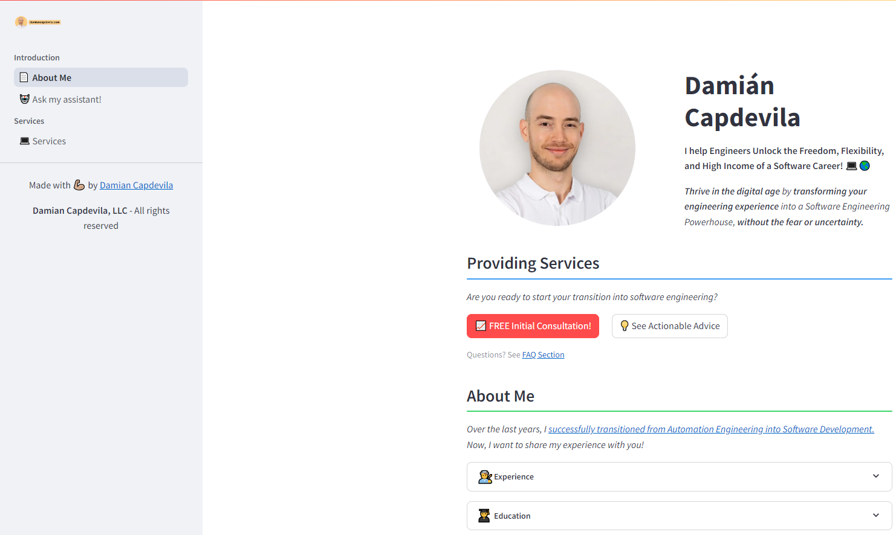

# Damián Capdevila - Personal Website

This repository contains the source code for Damián Capdevila's personal website, built using Streamlit. The website showcases Damián's professional profile, services, and expertise in helping engineers transition into software careers.



## About Damián Capdevila

Damián Capdevila is a Software Engineer with a background in Automation Engineering. He specializes in helping engineers unlock the freedom, flexibility, and high income potential of a software career. With seven years of experience spanning Software Engineering, Automation Engineering, Solutions Engineering, Pre-sales, and Academic Research, Damián offers valuable insights for those looking to transition into software development.


## Website Features

1. **About Me**: An introduction to Damián's background, experience, and unique value proposition.
2. **Services**: Information about the services Damián offers, including consultations and career transition guidance.
3. **Chat Assistant**: An AI-powered assistant using OpenAI API to answer questions about software engineering careers.
4. **Appointment Booking**: Integration with Cal.com for easy scheduling of consultations and services.

## Technical Details

The website is built using:
- Streamlit: A Python library for creating web applications
- OpenAI API for the chat assistant functionality
- Cal.com integration for appointment booking

Key files:
- `src/streamlit_app.py`: Main application file
- `src/app_pages/about.py`: About page content
- `src/app_pages/services.py`: Services page content
- `src/assets/string_constants/about_resources.py`: Text constants for the about page
- `src/utilities/helper.py`: Helper functions for common components

## Getting Started

To run this website locally:

1. Clone the repository
2. Install the required dependencies:
   ```
   pip install -r requirements.txt
   ```
3. Set up environment variables for OpenAI API and Cal.com integration

4. Run the Streamlit app:
   ```
   streamlit run src/streamlit_app.py
   ```

## Project Structure

```
damian-capdevila-personal-website/
├── src/
│   ├── app_pages/
│   │   ├── about.py
│   │   └── services.py
│   ├── assets/
│   │   ├── images/
│   │   └── string_constants/
│   │       └── about_resources.py
│   ├── utilities/
│   │   └── helper.py
│   └── streamlit_app.py
└── README.md
```

## Contributing

This is a personal website, but if you notice any issues or have suggestions for improvements, please feel free to open an issue or submit a pull request.

## License

This project is licensed under the MIT License. See the [LICENSE](LICENSE) file for details.

### Streamlit License

This project uses Streamlit, which is also licensed under the MIT License. The Streamlit license can be found [here](https://github.com/streamlit/streamlit/blob/develop/LICENSE).

## Contact

For more information or to book a consultation, visit [Damián's LinkedIn Profile](https://www.linkedin.com/in/damiancapdevila) or use the booking system integrated into the website.